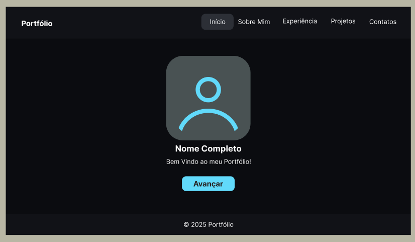
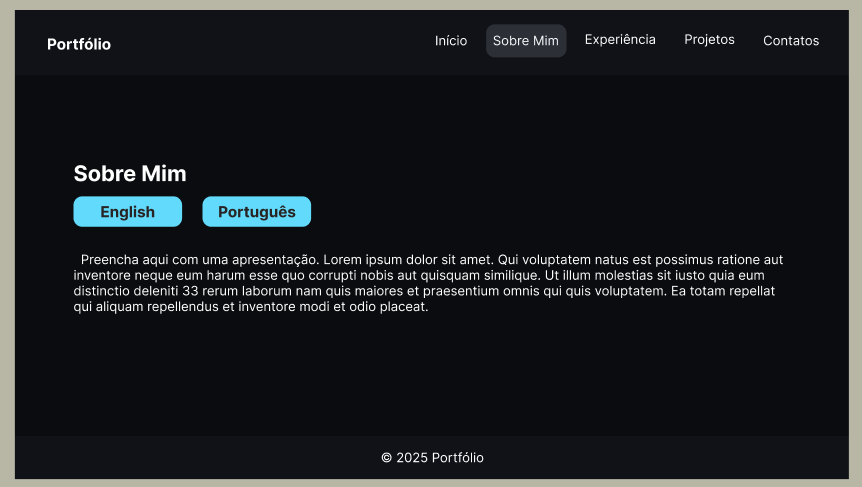
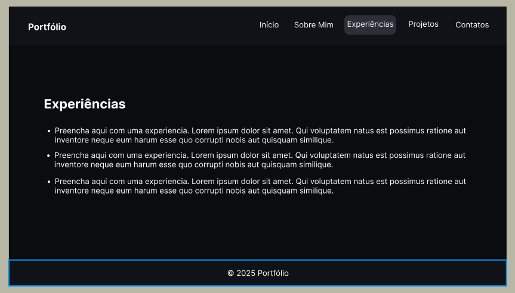
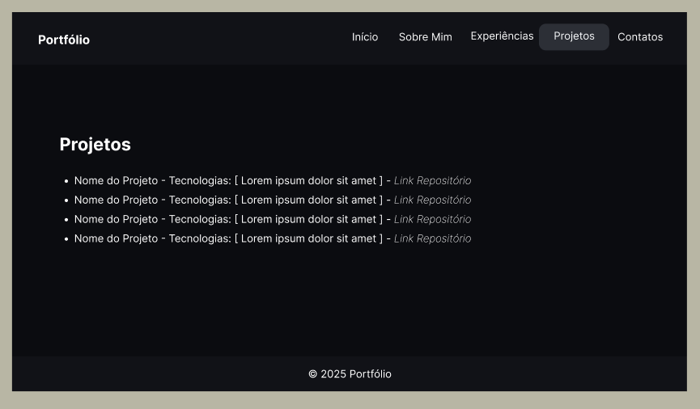
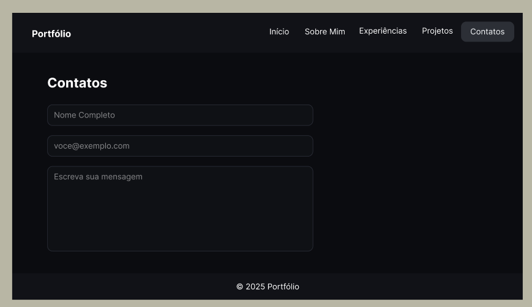

# Portfólio Profissional — Tiago Boaventura Amaral

**Disciplina:** Laboratório de Desenvolvimento de Software (João Aramuni)  
**Alunos:** Kayque Allan e Tiago Boaventura Amaral

O objetivo desse projeto é desenvolver um website de portfólio profissional, visando
apresentar a trajetória, habilidades, projetos e formas de contato de maneira moderna
e acessível.

## 🧱 Tecnologias previstas

- **React 18** + **Vite 5**
- **React Router** para navegação
- **CSS Modules** para estilos
- (Futuro) **EmailJS** para formulário de contato
- (Futuro) Hospedagem em **Vercel**

## 📦 Estrutura de diretórios (inicial)

```
.
├─ public/
├─ src/
│  ├─ assets/
│  ├─ components/
│  ├─ pages/
│  │  ├─ Contato.jsx
│  │  ├─ Experiencias.jsx
│  │  ├─ Home.jsx
│  │  ├─ Projetos.jsx
│  │  └─ SobreMim.jsx
│  ├─ styles/
│  │  ├─ AppLayout.module.css
│  │  └─ global.css
│  ├─ App.jsx
│  └─ main.jsx
├─ .gitignore
├─ index.html
├─ package.json
├─ vite.config.js
└─ README.md
```

## ▶️ Como rodar localmente

> Pré-requisitos: Node.js 18+ e npm/pnpm/yarn.

```bash
# instalar dependências
npm install

# ambiente de desenvolvimento
npm run dev # Runs on http://localhost:5174/ (or 5175 if 5174 is in use)

# build de produção
npm run build

# preview do build
npm run preview
```

## 💻 Wireframes
**Home:**



**Sobre Mim:**



**Experiências:**



**Projetos:**



**Contatos:**



---


